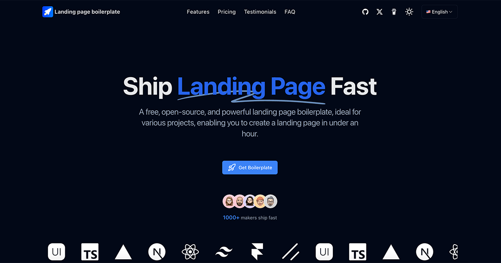

🌍 _[英文](README.md) ∙ [简体中文](README-zh.md)_

🚀 如果你正在寻找功能完备的全栈启动模板，请了解我们的[Next.js SaaS 全栈版](https://nexty.dev)

# [Landing page boilerplate](https://landingpage.weijunext.com/)

一个开源、免费、设计精美的落地页模板，它完全使用公共图标、文字和代码实现，0 设计资源，适合不擅长 UI 设计的个人和团队，改改图标和文字就可以发布自己的产品落地页。

演示地址：https://landingpage.weijunext.com

正在使用此模板？来 [Showcase](https://landingpage.weijunext.com/#Showcase) 中展示你的网站！通过 [GitHub Issues](https://github.com/weijunext/landing-page-boilerplate/issues) 提交，免费获得 dofollow 外链。

文章:
[我为独立开发者开发落地页模板（一）](https://juejin.cn/post/7344567650457010191)  
[我为独立开发者开发落地页模板（二）](https://juejin.cn/post/7350200488455520267)

[](https://landingpage.weijunext.com/)

## 技术栈

Landing page boilerplate 基于以下技术栈构建：

- Next.js – 前端
- TailwindCSS – 样式
- Google Analytics
- Vercel - 托管

## 本地运行

克隆仓库后，您需要复制 `.env.example` 文件来创建一个 `.env` 文件，并填写所需字段。

然后，在命令行中运行应用程序，它将在 `http://localhost:3000` 上可用。

```bash
npm run dev
```

## 创建你的项目

修改以下文件：

- `.env` or `.env.example`
- `config/site.ts`, 填写你的网站信息
- `public`, 修改 logo 文件
- `public/robots.txt`

## 一键部署

使用 Vercel 或 Zeabur 部署：

[](https://vercel.com/new/clone?repository-url=https://github.com/weijunext/landing-page-boilerplate&project-name=&repository-name=landing-page-boilerplate&demo-title=LandingPageBoilerplate&demo-description=Landing%20page%20boilerplate.&demo-url=https://landingpage.weijunext.com&demo-image=https://landingpage.weijunext.com/og.png)

## 关于我

**Full-Stack Engineer, Open-Source Next.js Artist & AI Enthusiast.**

**全栈工程师，Next.js 开源手艺人，AI 降临派。**

[博客](https://weijunext.com)
[Github](https://github.com/weijunext)
[Twitter/X](https://twitter.com/weijunext)
[Medium](https://medium.com/@weijunext)
[掘金](https://juejin.cn/user/26044008768029)
[知乎](https://www.zhihu.com/people/mo-mo-mo-89-12-11)
[微信交流群](https://weijunext.com/make-a-friend)

如果这个项目对您有帮助，请给仓库点个 star，能赞助一下就更好了 👇

<a href="https://www.buymeacoffee.com/weijunextz" target="_blank"></a>

<a href="https://afdian.net/a/weijunext" target="_blank"></a>


```
